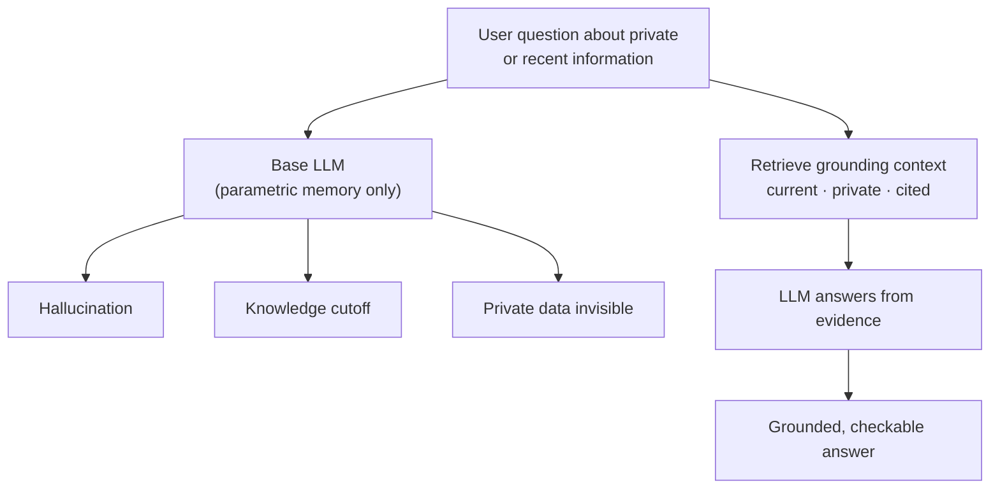

* TOC
{:toc}

## The three problems RAG exists to solve

Before touching any RAG machinery, the course frames *why* it's needed at all. Ask a base LLM (the class used GPT-4o-mini as the example, deliberately picking an older model with an old knowledge cutoff) a question about private, internal, or recent information, and you get one of three failure modes:

1. **Hallucination** — a confident, fluent, wrong answer.
2. **Knowledge cutoff** — the model simply doesn't know anything past its training date.
3. **Private data invisibility** — the model was never trained on your organization's data and never will be, because you can't (and shouldn't) hand a foundation-model vendor your private documents to fine-tune on every time they change.

The uncomfortable part is that all three failure modes *look* the same from the outside — confident, well-formatted prose — which is precisely the danger. RAG's job is to ground generation in retrieved, current, private context so the model answers from *evidence* rather than parametric memory.

{: .note }
This is a useful framing to reuse when someone asks "why not just use a bigger model / fine-tune instead of RAG": fine-tuning doesn't fix knowledge cutoff (you'd have to retrain constantly) and doesn't solve the private-data problem any better (you still need governed access), it only shifts *where* the cost is paid.

## Token economics: the "burn more tokens" myth

A recurring, half-joking debate in the cohort was whether burning more tokens signals seniority as an AI engineer. The instructor's answer, worth keeping verbatim in spirit:

- Amazon reportedly measured engineer performance partly by tokens consumed per employee — and had to walk it back once they realized it just incentivized burning tokens on unneeded tasks, purely for the metric.
- Nvidia's CEO has publicly encouraged people to use LLMs *more*, for an obvious reason: more usage is more revenue for compute providers. That's a legitimate business incentive for Nvidia — it isn't automatically a good engineering practice for you.
- The actual metric that matters is **outcome per token spent** — how efficiently you complete the task, not how much compute you moved through it.

### IDE/agent tooling comparison mentioned in class

| Tool | Instructor's take |
|---|---|
| **Cursor IDE** | Cheaper, faster, has its own in-house "Composer" model tuned for coding tasks at a fraction of the cost/latency of routing everything through Claude or Copilot |
| **Claude Code / Copilot (GPT-based)** | Best raw reasoning for genuinely hard problems — reach for these when the task is actually complex, not by default |
| **Practical rule given to students** | Use the cheap, fast agentic coding tool for routine work; reserve the frontier "thinking" model (e.g., Opus-class) for the subset of tasks that actually need it |

This is the same **cost-based routing** idea that reappears later as a formal LangGraph pattern (see [LangGraph Patterns](11-langgraph-patterns)) — classify the task complexity, then route to the cheapest model that can still do it correctly.

## "Learn the city, not just the arrow"

A story the instructor returned to more than once (see [Career & Industry Notes](15-career-and-industry-notes) for the full version): someone who only follows an AI tool's suggestions is like a driver who only follows turn-by-turn directions and never learns the city — the moment the signal drops (a bug the tutorial never covered, a production edge case, a client question with no clean answer), they're lost. Someone who understands the underlying "map" — the actual reasoning behind chunking trade-offs, retrieval strategy choices, evaluation methodology — keeps driving.

The practical takeaway baked into every assignment in this course: **never turn in a strategy without a justification**. "I used semantic chunking" is not an answer; "I used semantic chunking because recursive gave comparable Recall@3 but semantic held together better on our compliance-document domain, verified against a 26-question golden set" is the answer the instructor is looking for — and it's the same standard worth holding yourself to in an interview or a design review.

## Data science vs. generative AI, quickly

One clarifying question that came up: what's actually different about GenAI versus the predictive ML most of the cohort already knew?

- **Predictive/discriminative ML** learns `P(y | x)` to classify or score *existing* inputs — is this transaction fraud, will this customer churn.
- **Generative AI** models the underlying data distribution to *synthesize new* content — text, code, structured documents — typically via autoregressive next-token prediction rather than a fixed classifier/regressor head.

Both live in the same toolbox; a production system (like the capstone projects in this course) routinely uses a predictive model for anomaly detection or scoring *alongside* a generative model for the conversational or content-generation layer.
