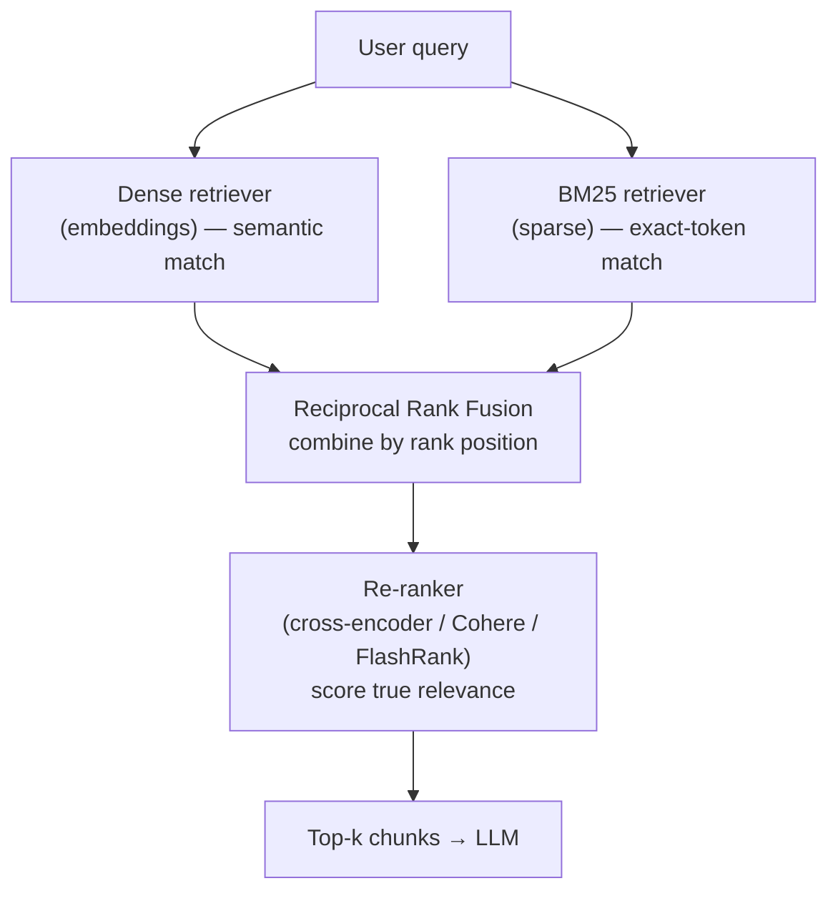

* TOC
{:toc}

## Why dense embeddings alone aren't enough

This is the single most detailed technical thread in the whole course, and it's worth reconstructing carefully because the reasoning matters more than the conclusion.

Dense (embedding-based) retrieval is excellent at **semantic matching** — paraphrase, synonymy, intent. But it has four specific, named drawbacks:

1. **No guarantee on exact-token matching.** Domain-specific identifiers — error codes, SKUs, citation numbers — often weren't meaningfully represented during the embedding model's training. An error code like `E123` might embed into a semantic space with *no real connection* to your domain, because the model has never seen it in a meaningful context.
2. **Razor-thin score margins.** In a worked example, two chunks — one mentioning `E123`, one mentioning `E236` — scored 0.59 and 0.60 on cosine similarity against a query about `E123`. The *correct* chunk technically ranked first, but the margin was so small it's barely distinguishable from noise. The retrieval "worked," but not with any real confidence.
3. **Every query costs a model call.** Each user question has to be embedded via an API call before it can be compared — a real, recurring cost.
4. **It's a black box.** You cannot ask *why* a given chunk was retrieved. You don't know whether `E123` was tokenized as one token or three, or how it collided with unrelated tokens in the embedding space. This matters when something goes wrong in production and you need to explain it.

## BM25: TF-IDF's more disciplined cousin

BM25 addresses TF-IDF's core weakness directly. TF-IDF has **no ceiling** — a word appearing 100 times in a document scores proportionally higher than one appearing once, with no diminishing returns, which lets long, keyword-stuffed documents dominate purely on repetition.

BM25 caps this with two tunable knobs:

- **`k1`** (typically 1.2–2.0) — controls how quickly term-frequency saturation kicks in. Repetition helps, but with rapidly diminishing returns.
- **`b`** (typically 0.75) — length normalization. Without it, a long document wins purely by having more words, not more *relevance*.

The formula (kept here exactly as taught, not because you need to memorize it, but because the shape of it explains the saturation behavior):

```
score(D, Q) = Σ IDF(qi) · [ f(qi, D) · (k1 + 1) ] / [ f(qi, D) + k1 · (1 − b + b · |D|/avgdl) ]
```

**Where BM25 wins decisively:** exact, domain-specific string matching. The class example — *"error constant timeout occurs when a database connection exceeds the 30 second limit"* — scored 0.826 on BM25 (a clear top hit) versus a much flatter, less confident dense-retrieval score for the same query, because BM25 weights the exact term match heavily while dense retrieval spreads its attention across every token in the query.

{: .warning }
**BM25's own blind spot, demonstrated live:** a query for *"what did Python 3.11 add for error messages"* failed under BM25 because the tokenizer split `3.11` into separate tokens (`3`, `11`) that then matched *`3.10`* just as well as `3.11` — BM25 has no notion of numerical proximity, only token overlap. Dense retrieval got this one right, because it correctly captured the semantic intent even with imperfect tokenization.

**SPLADE**, mentioned as a middle ground: a learned-sparse model that combines BM25-style exact matching with BERT-derived semantic understanding in a single representation, aiming to capture the strengths of both approaches without running two separate retrieval systems.

## Hybrid retrieval and Reciprocal Rank Fusion

**"It must be hybrid always in case of production"** is stated flatly, more than once, across sessions. Run both retrievers, fuse their ranked lists, then re-rank the survivors:



The mechanism used to combine BM25 and dense rankings is **Reciprocal Rank Fusion (RRF)**:

```
score(doc) = Σ 1 / (k + rank_i(doc))
```

summed across each retriever's ranked list (a typical `k` is 60, though the exact constant matters less than the shape).

### RRF's own documented weakness

This is a genuinely subtle point the instructor flagged explicitly, and it's worth internalizing: **RRF only sees rank position, not the underlying score magnitude.** If the #1 and #2 ranked documents from a given retriever have wildly different relevance scores, RRF treats that gap identically to a case where #1 and #2 are nearly tied. This means RRF can't distinguish "the top result is clearly the best" from "the top two results are basically indistinguishable" — it blindly accepts everything into the fusion competition on rank alone, including documents that may not actually be very relevant.

**Practical implication:** RRF is a good default *combination* mechanism, but it isn't a substitute for a re-ranking pass — see the note on re-ranking's role in [RAG Evaluation](06-rag-evaluation-ragas).

## Choosing the number of chunks to retrieve (top-k)

Explicitly called out as **an experimentation decision, not a fixed rule**: pick k too small and you risk missing an important chunk; pick k too large and you add noise and cost. There's no universal right answer — it has to be tuned against your own golden dataset and evaluation metrics (see next page), and re-validated whenever your chunking or embedding strategy changes.
