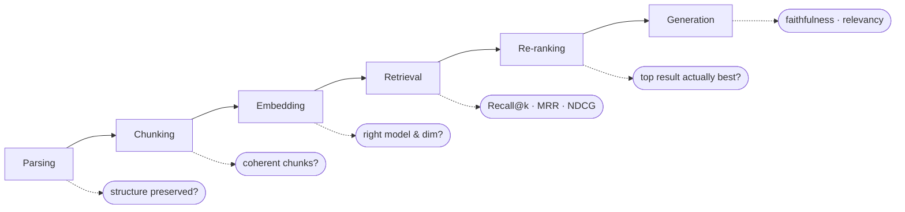

* TOC
{:toc}

## Why you can't skip this

The instructor's framing: in classic ML, you already know to report accuracy/recall/precision/F1 for classification or MSE/RMSE/MAE/R² for regression. RAG needs the exact same discipline — a repeatable, numeric way to say "this pipeline is good" rather than eyeballing a few outputs. Three metrics were taught as the ones worth knowing cold, because they come up in interviews and in resume bullet points: **Recall@k, MRR, and NDCG@k**.

## Worked example: building intuition for Recall@k

Set up a tiny golden dataset by hand:

- 5 chunks/documents exist: `[1, 2, 3, 4, 5]`
- 3 questions exist, each with a known correct chunk: Q1→3, Q2→2, Q3→5

Run the actual RAG pipeline (chunking → embedding → hybrid retrieval → RRF) and ask for the top-3 results per question:

| Question | Correct chunk | Retrieved (top 3, ranked) |
|---|---|---|
| Q1 | 3 | `[3, 1, 4]` |
| Q2 | 2 | `[1, 2, 4]` (or `[1,2,5]` in a later variant) |
| Q3 | 5 | `[5, 2, 4]` |

**Recall@1** asks only: *was the correct chunk the very first result?* For Q1, yes (3 is first) — full credit. For Q2, no (1 is first, not 2) — no credit at Recall@1, even though 2 *did* appear in the top 3.

**Recall@3** is more forgiving: *did the correct chunk appear anywhere in the top 3?* Q2's chunk 2 shows up in position 2 — credit given.

**The practical decision this maps to:** if your product needs the single best answer shown with no ambiguity, optimize for Recall@1. If you're comfortable showing a ranked list of candidates (or re-ranking further downstream), Recall@3 (or higher-k) is the more honest metric to report.

## NDCG@k: when "correct" isn't binary

Recall treats retrieval as pass/fail. **NDCG (Normalized Discounted Cumulative Gain)** allows *graded* relevance — chunk A might be fully relevant, chunk B partially relevant, chunk C irrelevant — and rewards ranking the most relevant items highest, discounting relevant items that show up lower in the list. The worked example in class assigned relevance labels (`3 = relevant, 2 = less relevant, 1 = not relevant`) to a retrieved list and computed the discounted gain against the ideal ordering.

## Where do golden datasets come from?

This is a question worth taking seriously, because it's a business/process question as much as a technical one:

- **First choice, always:** the golden dataset — sample questions plus their correct answers/chunks — should come from **whoever owns the document or domain knowledge**. The instructor is explicit that this is a *first-ask deliverable* you should request from a client before delivering any RAG product: "we need a ground truth golden dataset before we can tell you how good this is."
- **Fallback, when that's not available:** LLM-assisted golden-dataset generation. Frameworks like RAGAS and DeepEval can generate question/answer pairs automatically *from each chunk* — but this raises a real trade-off flagged in a live student question: if the reason you built RAG in the first place is to *avoid exposing your private data to an LLM*, using an LLM to auto-generate your golden dataset from that same private data partially defeats the purpose. Decide consciously, don't default into it.

In one student capstone (Amazon Seller Support bot), the golden dataset was built as **26 questions: 10 via keyword matching, 16 via semantic generation**, evaluated against a standard-error/noise threshold of 0.20 — a concrete, reproducible example of "how many questions is enough."

## RAGAS metrics available out of the box

| Metric | What it measures |
|---|---|
| **Faithfulness** | Is the generated answer actually supported by the retrieved context, or did the model add unsupported claims? |
| **Context precision** | Of the chunks retrieved, how many were actually relevant? |
| **Context recall** | Of the relevant chunks that exist, how many did retrieval surface? |
| **Context entities recall** | Did retrieval capture the specific named entities the question needs? |
| **Noise sensitivity** | How much does irrelevant retrieved content degrade the answer? |
| **Response relevancy** | Does the answer actually address the question asked? |
| **Multimodal faithfulness / relevance** | Same ideas, extended to image/table-containing content |
| **NVIDIA-family metrics** | Answer accuracy, context relevance, response groundedness — an alternate metric family available in the same tooling |
| **Tool-use metrics** | For agentic pipelines: did the agent call the *right* tool at the right point? |

### The four-category taxonomy for building a golden test set

When constructing evaluation examples by hand, the class used four labeled categories to make sure the test set actually exercises failure modes, not just happy paths:

1. **All good** — retrieved context supports the answer correctly.
2. **Hallucination** — the answer *contradicts* the retrieved context (e.g., context says `git reset --soft`, answer says `git reset --hard`).
3. **Off-topic answer** — the answer addresses a *different* question than the one asked, even if it's topically adjacent (context explains what causes a heart attack; answer talks about diet and exercise).
4. **Bad retrieval** — the retrieved context itself doesn't relate to the question, so no answer built on it can be trusted.

Building a handful of examples in *each* category — not just "good" examples — is what makes an evaluation harness actually catch regressions.

## Re-ranking: the pass RRF can't do alone

Re-ranking is a **second-pass model** — a cross-encoder, Cohere Rerank, or FlashRank — that re-scores the initially retrieved candidates for true relevance before they ever reach the LLM's context window. Given RRF's blind spot (rank-only, no score-magnitude awareness — see [Retrieval](05-retrieval-dense-sparse-hybrid)), re-ranking is the mechanism that actually distinguishes "clearly the best match" from "technically ranked first but barely."

{: .warning }
**Re-ranking has a real latency cost**, and one student capstone explicitly measured it: a cross-encoder re-rank stage was dropped from their final production pipeline specifically because the latency hit was "extremely high" relative to the accuracy gain over their already-strong Recall@1/@3 numbers. Always measure the latency/quality trade-off on your own data before assuming re-ranking is free value — see [Capstone Case Studies](14-capstone-case-studies) for the full comparison table.

## Evaluate at every stage, not just the end

A student asked directly: should evaluation happen once, at the end of the pipeline, or at each stage? The instructor's answer: **at each module** — parsing, chunking, embedding, retrieval, and re-ranking each get their own evaluation pass during development, so that when the end-to-end number is disappointing, you already know *which* stage to go fix instead of guessing.

