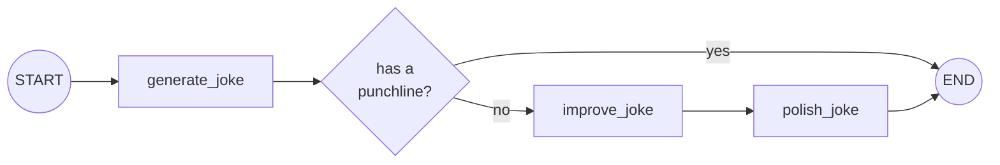
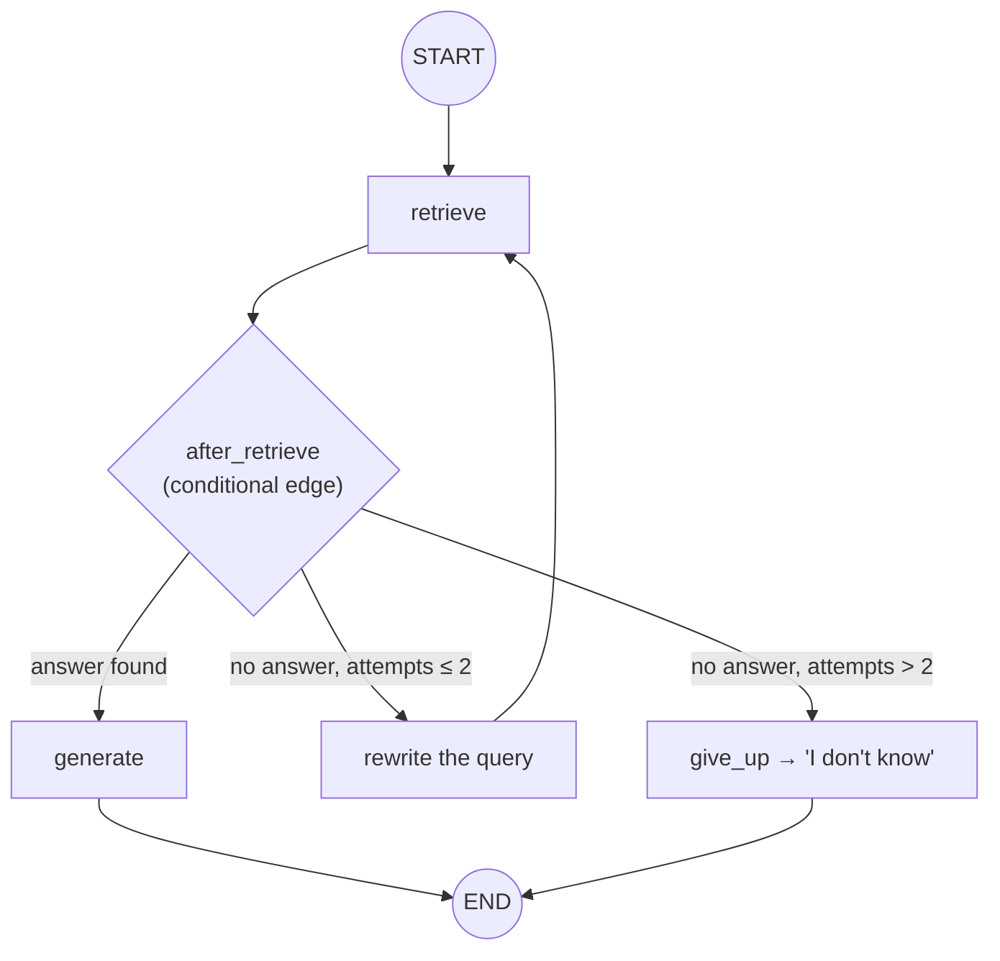

* TOC
{:toc}

## Why LangGraph, framed against what you already know

LangChain gives you a chain: retrieval, then generation, strictly forward, one direction, no going back. That's fine for a linear pipeline, but it can't express "if this fails, try something else and come back." LangGraph's whole reason for existing is to add **cycles, conditional branching, checkpointing, and human-in-the-loop interrupts** on top of the same underlying building blocks (models, tools) you already know.

Two framings the instructor used repeatedly, worth keeping:

- **"LangGraph is just a simple Python library"** — not a new product, not something requiring special infrastructure. Install it with `pip` or `uv`, same as pandas or any other library.
- **"Low-level orchestration framework, for building, managing, and deploying long-running stateful agents."** *Low-level* means you have full, explicit control — the opposite of a no-code, drag-and-drop tool like N8N, which trades control for a lower learning curve. N8N is worth knowing about conceptually (visual workflow builder for non-developers), but it's explicitly not the tool this course teaches, because production-grade customization needs the code-level control LangGraph provides.

## The four components you actually need

Every LangGraph application is built from exactly these:

| Component | What it is |
|---|---|
| **State** | A class (often a `TypedDict` or Pydantic model) defining every variable shared and updated across the whole workflow — think of it as the single source of truth all nodes read from and write to |
| **Node** | A function (or a whole sub-agent, or an entire RAG pipeline) that does one unit of work. Two hard rules: the function's *name* must match the name given in `add_node(...)`, and the function must accept the state as its parameter |
| **Edge** | A connection between two nodes — the deterministic, "always go here next" kind |
| **START / END** | Constants imported directly from LangGraph — you don't define them, you just wire your graph to them so the framework knows where execution begins and terminates |

The instructor's own analogy for state, worth keeping because it lands for anyone with a Keras/TensorFlow background: **`StateGraph` is to LangGraph what `Sequential()` was to Keras** — you initialize the container, then add nodes/layers to it one at a time before compiling.

## Building one from scratch: the joke-writer example

The first hands-on build, deliberately trivial so the mechanics are visible without any domain complexity getting in the way:



- **State** holds four fields: `topic`, `joke`, `improved_joke`, `final_joke`.
- **`generate_joke`** node calls an LLM: *"write a short joke about {topic}."*
- A **conditional edge** checks whether the generated joke already has a punchline. If yes, skip straight to END. If no, route to `improve_joke` ("make this funnier by adding wordplay"), then `polish_joke` ("add a surprising twist"), then END.
- `workflow.compile()` turns the assembled structure into a runnable object; `chain.invoke({"topic": "cats"})` runs it.

This tiny example already demonstrates the core payoff over a plain chain: **the graph can make a runtime decision** (does this need improvement or not?) instead of always executing every step in a fixed sequence.

## A second from-scratch example: issue triage

Built live to demonstrate a state class with several typed fields, deliberately domain-flavored (a customer-support ticket triage bot):

- **State fields:** `issue` (the raw text), `category`, `priority`, `response`.
- **Category node:** simple keyword matching against the issue text — words like "help/support/assistant" → `support`; "bug/error/issue" → `bug`; otherwise → `unknown category`. (The instructor notes explicitly that this could just as easily be done via an LLM call or semantic classification instead of keywords — keyword matching was chosen here purely to keep the example legible.)
- **Priority node:** maps category to priority (`support` → high, `bug` → medium, etc.)

**The debugging lesson embedded in this example is arguably more valuable than the example itself.** A live compile error occurred — "found at starting an unknown node" — because a node's function name and the name registered via `add_node()` didn't match exactly. The instructor's own commentary on this: this kind of mismatch **should be caught at compile time, but LangGraph only catches it at runtime**, which is a real, sharp edge in the framework worth being aware of before you hit it yourself in a live demo or production deploy. (He even suggested it as a legitimate open-source contribution opportunity.)

## Conditional edges, properly defined

A conditional edge is not itself a node — it's a **callable function that determines which node runs next**, based on the current state. The general shape:

```python
def after_retrieve(state):
    if state["attempts"] > 2:
        return "give_up"
    elif answer_found(state):
        return "generate"
    else:
        return "rewrite"

builder.add_conditional_edges("retrieve", after_retrieve)
```

The string returned by the conditional function **must exactly match a node name already registered** in the graph — the same fragile-matching gotcha as above applies here too.

### The retrieve → rewrite → generate → give-up pattern

A complete worked example, more developed than the toy joke graph, and worth understanding in full because it's the pattern most real RAG-agent hybrids end up using:



- **State:** `query`, `context`, `answer`, `attempts` (an integer counter).
- **`retrieve` node:** looks up context for the current query.
- **Conditional edge after retrieve** offers three branches:
  1. Answer found → `generate` (produce the final answer from context)
  2. No answer found, but attempts ≤ 2 → `rewrite` (reformulate the query, e.g. mapping "can I get my money back" to "refund policy"), then loop back to `retrieve`
  3. No answer found, and attempts > 2 → `give_up` (return "I don't know" rather than looping forever)

Run live against *"Can I get my money back?"* — the first retrieval attempt failed to match a "refund policy" document verbatim, the rewrite step reformulated it, and the second retrieval attempt succeeded, generating "refunds take five to seven business days to the original payment method."

{: .important }
**This loop-with-retry-and-give-up structure is precisely the capability a plain LangChain chain cannot express** — a chain would have returned "I don't know" on the very first failed attempt, with no mechanism to try again with a reformulated question. This is the concrete, hands-on version of "why LangGraph" that the course keeps returning to.

## Human-in-the-loop, introduced (fully developed in later pages)

Whenever an agent is about to perform something risky — updating or deleting a database row — LangGraph lets you pause execution and require explicit human approval before continuing. This is introduced here conceptually; see [Capstone Case Studies](14-capstone-case-studies) for how it's actually implemented in a real multi-agent build (a "safe tools" pattern gating any mutating database action).

## Observability with LangSmith

Every non-trivial agent eventually needs to answer: *"why did it give this particular answer?"* — especially once a workflow spans multiple nodes making independent decisions. **LangSmith** provides that trace: full visibility from individual LLM calls up to production-wide performance metrics, enabled with essentially one line (`@traceable` decorator, plus an API key and a tracing flag). Its value scales with graph complexity — for the trivial joke example it's overkill; for a multi-node, multi-agent production system, it's close to mandatory.

## LangGraph vs. LangChain vs. N8N, summarized

| | LangChain | LangGraph | N8N |
|---|---|---|---|
| **Control level** | Mid — unified provider interface, linear chains | Low — full code-level control, explicit state | High-level, visual, no-code |
| **Structure** | Sequential, forward-only | Graph: cycles, branches, retries | Drag-and-drop workflow canvas |
| **Best for** | Fast provider abstraction, straightforward pipelines | Stateful, long-running, retry-capable agents | Non-developers prototyping a workflow visually |
| **Who uses it** | Developers wanting less API boilerplate | Developers building production-grade agents | Non-technical users, rapid prototyping |

The instructor's one-line summary worth quoting directly: *"N8N is a visual agent workflow, and LangGraph is a graph-based agent"* — and for this cohort's purposes (building production-grade, customizable systems), LangGraph is the tool actually taught and used from here on.
