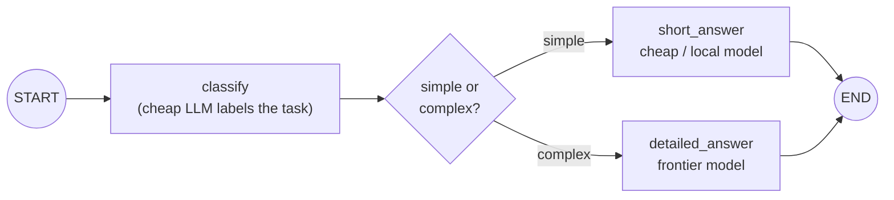
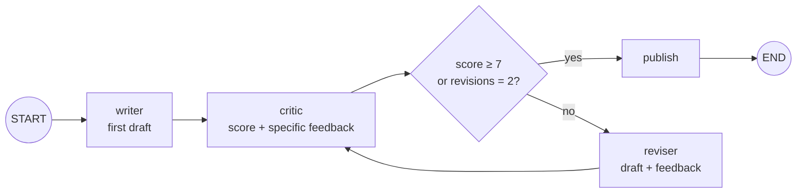
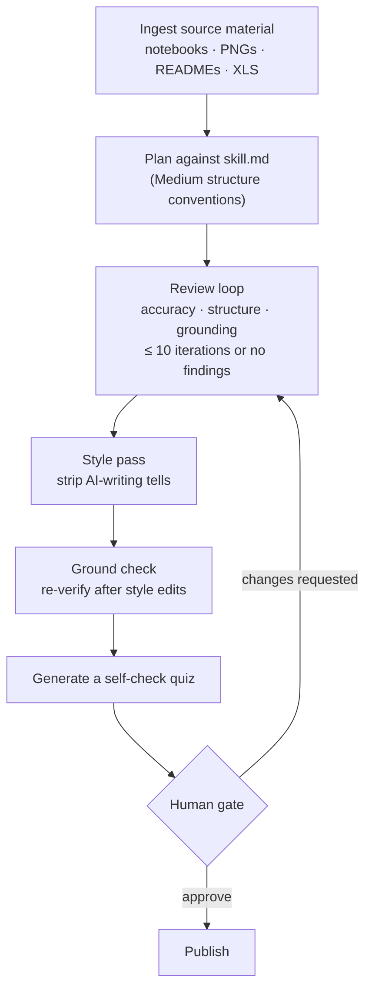

* TOC
{:toc}

Building on [LangGraph Fundamentals](10-langgraph-fundamentals), this page covers three reusable patterns the course built hands-on, each solving a different real production problem: **cost**, **quality through iteration**, and **giving up gracefully**.

## Pattern 1: Cost-based model routing

The setup: not every question deserves the most expensive model. A classify-then-route graph:

- **`classify` node:** an LLM call asks itself to label the incoming question as `simple` (a fact, a number, a one-shot answer — "2+2", "capital of France") or `complex` (comparison, trade-off, worked example, design/recommendation — "compare self-attention to recurrence for a 10,000-token document").
- **Conditional edge (`pick_path`)** routes to a `short_answer` node (instructed to answer in one sentence, using a **cheap model**) or a `detailed_answer` node (instructed to answer thoroughly, step by step, using a **more capable, more expensive model**).

### The economics, made concrete

The instructor walked through illustrative per-model costs (not exact current pricing, just to make the shape of the argument tangible): a frontier model might cost several times more per million tokens than a lightweight one, and a local/open-source model can be effectively free. Applying this routing pattern to a monthly LLM bill of roughly $1,000 was estimated to plausibly cut it to $300–700 — and the same logic scales to millions of dollars at real enterprise volume. **This is explicitly framed as a realistic interview question**: *"how will you make your LangGraph optimize cost? How do you decide which LLM to use for the same agent?"* — cost-based routing via a classify node is the answer.

### Where this pattern applies in practice

- **Customer-support FAQ:** simple retrieval-backed answers → cheap model (Haiku-class, Ollama, any lightweight open model). No reason to spend Opus-tier money on a lookup.
- **Genuinely difficult support case:** multi-step tool use (search ticket, apply refund, escalate) → a more capable model, because the task itself needs stronger reasoning, not just retrieval.

## Pattern 2: The writer–critic–reviser self-refinement loop

A second graph structure, aimed at quality rather than cost, built around three nodes in a cycle:

- **`writer`** produces a first draft (an article, a paragraph, whatever the task is).
- **`critic`** reviews it, scores it, and produces specific feedback (in the class's live example, feedback like *"add more detail about practical application of LangGraph and LangChain to illustrate the differences"*).
- **Conditional edge** checks: is the critic's score above a threshold (7 out of 10, in the demo), or has the revision count already hit a cap (2, in the demo)? If either is true, stop and publish. Otherwise, route to `reviser`, which rewrites using the writer's draft plus the critic's feedback, and loops back to `critic` for another pass.

**Why a chain can't do this:** LangChain's linear, one-directional structure is well-suited to strict, ordered pipelines (extract → transform → load, document processing) where each step completes once and hands off. It has no native way to say "go back and try again based on feedback." LangGraph's cycle capability is exactly what makes iterative self-improvement possible.

## Pattern 3: The "Medium article writer" — a fuller production version of the loop

A more elaborate version of the writer–critic loop, built as a live demo, worth its own entry because it adds several production-relevant refinements on top of the basic pattern:

The stages, in order:

1. **Ingestion:** consume source material of any format (notebooks, PNGs, READMEs, XLS) as input.
2. **Planning:** a `skill.md` file encodes what a good Medium article's *structure* should look like (Medium has known conventions for what gets accepted/read well), and the plan step follows it.
3. **Review loop:** technical accuracy, structure, and grounding are checked; feedback is applied; this repeats for up to **10 iterations** or until no findings remain, whichever comes first (the same score-or-cap-triggered exit condition as Pattern 2, just with a higher iteration ceiling appropriate to a longer-form task).
4. **Style pass:** a dedicated pass specifically to strip telltale AI-writing artifacts (em dashes, certain repetitive phrasing patterns) — explicitly framed as making the output not read as obviously AI-generated.
5. **Ground check:** one more explicit hallucination/false-information check *after* the style pass, because style edits can themselves introduce subtle inaccuracies.
6. **Quiz generation:** the graph generates a short quiz from the article, used as a lightweight self-check ("do I actually understand what I just had written for me?").
7. **Human gate:** a final human-in-the-loop checkpoint before publishing — the human can approve as-is, or request specific further changes, which re-triggers the review-rewrite loop with that feedback folded in.

This example is worth returning to because it demonstrates that "loop until good enough" (Pattern 2) is a *component*, not the whole architecture — a real production pipeline wraps that core loop with pre-processing (planning against a style guide) and post-processing (style pass, grounding check, human approval) stages around it.

## The recurring shape across all three patterns

Every pattern here reduces to the same underlying LangGraph primitive from [Fundamentals](10-langgraph-fundamentals): a **conditional edge deciding the next node based on current state**. What changes is only *what* the condition evaluates — task complexity (routing), a quality score against a threshold (refinement), or a human's explicit decision (approval gates). Recognizing that all three are the same mechanism wearing different clothes is more useful than memorizing them as three unrelated recipes.
