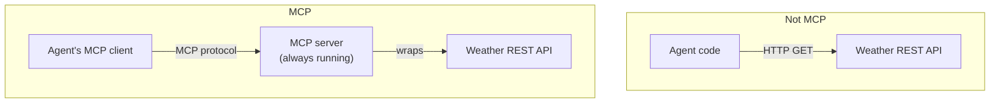
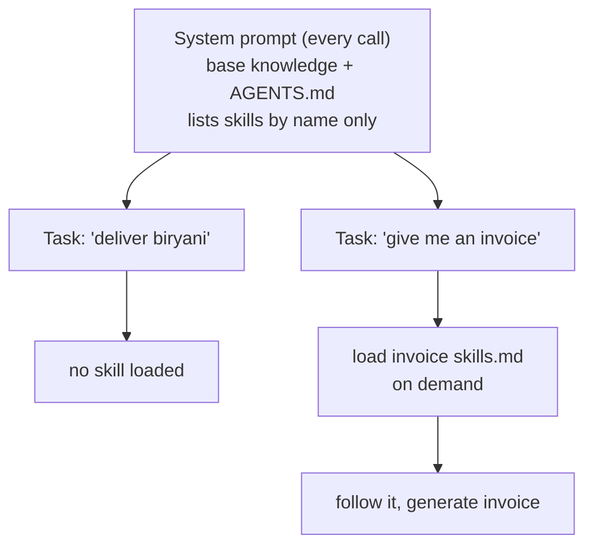

* TOC
{:toc}

## What MCP actually requires (the correction worth remembering)

This is the single most important conceptual correction from the entire course on this topic, and it came from a real mistake made mid-build. A student, building her capstone, described her weather integration as "MCP" — but what she'd actually built was a plain API client wrapping a weather REST endpoint. The instructor's correction:

> "That's an API call. So you should create an MCP server... MCP is something that's always going to be up and running. Either you use the provider's own MCP server if they have one, or you stand up your own — one that stays running and that your MCP *client* connects to."

**The distinction that matters:** MCP isn't just "an agent calling an external API" — it specifically requires a **standing server** implementing the protocol, which a client then connects to. If a third party already exposes an MCP server (increasingly common as the ecosystem matures), you can call it directly. If they don't — as with a generic weather API — you build and deploy your own MCP server as a thin wrapper around that API, and *then* your agent's MCP client talks to that server. Calling the raw REST endpoint directly from your agent code, no matter how clean the code is, is not MCP.

This distinction matters practically: an MCP server is a piece of infrastructure with its own deployment and uptime lifecycle, not just a Python function. Budget for that when planning an MCP-based integration.

## MCP as "USB-C for AI tools" — the interoperability pitch

Beyond the mechanics, MCP's value proposition as taught: instead of writing bespoke, point-to-point integration code for every tool your agents need (one custom wrapper for weather, another for a calendar, another for a CRM), MCP standardizes the *connector* — one protocol, reusable across frameworks and vendors, so tool integrations aren't reinvented per project. As your tool ecosystem grows, this interoperability compounds; a handful of custom API wrappers is manageable, dozens become genuine integration debt that MCP is designed to avoid.

## Deep Agents: an "agent harness," not just another agent

A new concept introduced late in the course, deliberately distinguished from a regular LangGraph agent. The instructor's framing question, put to the class directly: *"we know what an agent is — given a task, it takes action to complete a goal. But what's an agent **harness**?"*

The `deepagents` library (open source) is described as: **an agent harness built for long-running tasks — handling planning, context management, and multi-agent orchestration for complex work like research and coding.** The practical entry point is a single function, `create_deep_agent(model=..., tools=...)` — parallel to `create_agent` in plain LangGraph, but pre-loaded with a much richer built-in toolkit.

### Built-in harness tools (no need to write your own)

| Tool | Purpose |
|---|---|
| `ls` | List files in a directory |
| `read_file` | Read file content with line numbers — natively supports PDF, PPTX, images, video, and more, without needing separate format-specific libraries |
| `write_file` | Create or overwrite a file |
| `edit_file` | Exact string replacement within a file |
| `delete_file` | Remove a file |
| `glob` / `grep` | Search across files by pattern or content |
| `execute` | Run code, with sandboxed backend interpreter options |

The instructor's point in walking through this list: this is the *same* toolkit underlying agentic coding tools like Claude Code — `read_file`/`write_file`/`edit_file`/`grep` is how those tools actually read your codebase and make changes. Deep Agents gives you that same toolkit for building your *own* long-running agents, without writing file-I/O tooling from scratch.

## Skills: the answer to system-prompt bloat

This is the most conceptually important idea in this section, and it's worth building up the reasoning the way it was presented, because the "why" is what makes it stick.

**The problem:** a system prompt is sent with *every single request*. Every capability you want your agent to potentially have — how to access a weather server, how to generate an invoice, how to run a specific multi-step planning process — costs tokens on every call, whether or not that particular request needs it. Cramming everything into the system prompt is both expensive and eventually unworkable as capabilities grow.

**The delivery-driver analogy used in class:** imagine a delivery driver (the LLM) who knows the roads and how to navigate — that's the baseline knowledge, always loaded. But you don't hand them a full manual of what to do if their bike gets a flat tire, or their phone stops working, on every single delivery. Instead, you give them a **toolkit reference** — "if the bike breaks down, here's the skill sheet for that; read it *only when you need it*, then act."

**The mechanism: `skills.md` files, referenced (not embedded) from `AGENTS.md`.** Rather than pasting every possible capability into the system prompt, you write a lightweight `skills.md` describing a specific capability in detail, store it as a file, and reference it by name from the main `AGENTS.md`/system prompt. The harness loads the actual skill content **progressively, on demand** — only when the current task genuinely needs it — rather than paying its token cost on every single call.

**The worked example:** asked to *"deliver chicken biryani"*, the agent doesn't need (and doesn't load) the invoice-generation skill — that skill "stays closed." Asked instead *"can you give me an invoice"*, the agent *now* loads the invoice skill, follows its instructions, and generates one. Same agent, same base system prompt — the skill is only pulled in when actually relevant.

### Skills vs. tools vs. sub-agents — when to use which

This distinction came up directly in a live capstone debugging session and is worth stating cleanly:

| Concept | What it is | Cost model |
|---|---|---|
| **Tool** | A callable function with a fixed schema, always available for the LLM to invoke | Metadata cost paid on every call regardless of use |
| **Skill** | Reference/procedural knowledge (a markdown file) loaded on demand | Zero cost until actually needed; then loaded progressively |
| **Sub-agent** | A smaller agent with its own narrow instructions, invoked for one focused sub-task | A full LLM call, scoped to a specific purpose (see [Multi-Agent Architectures](12-multi-agent-architectures)) |

**The live debugging moment worth remembering:** a student's "deep agent" node wasn't actually behaving like a deep agent — it was "behaving like a normal node, this deep agent one... like a deep line graph" instead of genuinely using the framework's planning/skill capability. The root cause, diagnosed live: the coding agent she'd used to scaffold it didn't have training knowledge of Deep Agents yet (a very recently released library), so it silently wrote something that merely *resembled* a deep agent without actually using its distinguishing capabilities (skills, planning). **The fix instruction given:** explicitly tell the coding assistant to go read the current LangGraph/LangChain/Deep Agents documentation from the internet rather than relying on its training data, specifically *because* the library was too new for the assistant to already know it well.

{: .interview }
This is a genuinely good example to have ready for "tell me about debugging something an AI coding tool got wrong" — the failure mode wasn't a bug in the traditional sense, it was an AI assistant confidently generating code for a library it didn't actually have accurate knowledge of, and the fix was recognizing that pattern and redirecting it to current documentation rather than trusting the first plausible-looking output.

## Sandboxed code execution

Deep Agents supports running and evaluating generated code directly, via sandboxed backend interpreters — meaning the harness itself can write code, execute it, check the result, and iterate, rather than only ever producing code for a human to run separately. This is part of what makes it suited to "long-running tasks like research and coding" as opposed to a single-shot Q&A agent.
