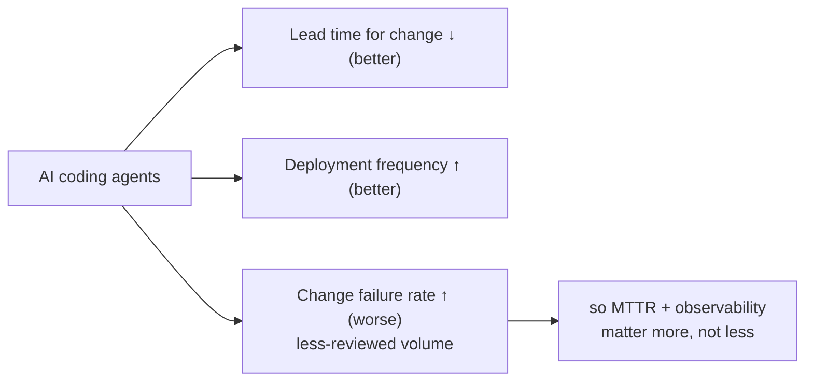

* TOC
{:toc}

This page collects the non-technical (but genuinely high-value) parts of the course: the instructor's recurring arguments about *why* the deep, slow way of learning still matters in an AI-tool-saturated industry, and a guest Q&A with engineers describing how this actually plays out inside a large tech company.

## "Did you learn the city, or just follow the arrow?"

Prompted by a real student story: a colleague with no coding background used an AI coding agent to assemble a working RAG chatbot in roughly an hour and impressed leadership with the demo — which understandably triggered some self-doubt in students who'd been spending weeks on fundamentals instead.

The instructor's answer, built around an analogy worth keeping in full:

Two people learn to drive somewhere new. One follows GPS turn-by-turn directions exclusively, never looking up, never building a mental map. The other takes it slower, actually watches the landmarks, learns the junctions and shortcuts. Both arrive at the destination the same number of times — **until the day the signal drops.** The GPS-only driver is instantly lost, staring at a frozen blue line, with no idea which direction their own home is in, because they never actually learned the city — only the arrow. The one who built a mental map just keeps driving.

**Applied directly to AI-assisted engineering:**

- AI coding tools can absolutely get someone from zero to a working demo fast — that's genuinely happening, and the instructor is explicit about not dismissing it as fake or worthless.
- But a demo that works once, in front of the right people, is a fundamentally different thing from something that **survives production edge cases, scales, and can be fixed when it breaks.**
- **"Building has become very cheap. Understanding why something works, why it fails, and how to make it better has become the valuable thing."** Nearly anyone can now generate code that *looks* plausible; almost no one can reliably tell whether it's actually correct, or repair it when it isn't. That gap — not the ability to produce code in the first place — is what a career gets built on.

**The practical instruction that follows from this, and the actual reason every assignment in this course demands a justification for every strategy chosen:** use AI tools aggressively, as an amplifier on top of your own reasoning — not as a substitute for it. The specific muscle worth building for "the next 5 to 10 years," in the instructor's words: *go deep on what doesn't change* — the math, evaluation methodology, systems thinking, problem framing, and logical reasoning underneath whatever the current tool happens to be.

## The clay-pot craftsman story (a shorter aside on where value comes from)

A second parable, shared as a motivational aside rather than a technical point, but worth keeping because of the twist the instructor added to it. The original story: a craftsman in his home village is chronically undervalued and bargained down to nothing, until a traveler recognizes his work's real worth and invites him to a city where the same craftsmanship is prized. The stock lesson: *"you're not failing, you're just planted in the wrong place — find where people value what you do."*

**The instructor's addition, which is the actually useful half:** it's not enough to go find people who'll value you — **you have to first become someone worth valuing**, by continuing to do good work even when nobody's watching or applauding. The traveler only stopped because the craftsman kept making genuinely good pots the whole time, unnoticed. A careless pot, however well-timed the traveler's visit, would never have been picked up. Applied to a career: "value is not something you find, it is something you generate, and then the right people will recognize it" — and it goes both ways, since recognizing and valuing *other* people's work is part of the same discipline, not a separate virtue.

## Guest Q&A: a Google engineer on where the industry actually is

A guest speaker (a mentor of the instructor's, working at Google) joined one session for live Q&A. Kept here close to the original shape because the specifics matter more than a paraphrase would preserve.

### On AI-generated code and DORA metrics

The core observation: AI coding agents have made **lead time for change** (how fast code gets written and shipped) dramatically faster — but **change failure rate** is rising in parallel, because a large volume of AI-generated code isn't being reviewed with the same rigor a human-authored change would get. His framing: *"bringing AI now is actually creating more noise than value — but that's how it will start."* He drew a direct parallel to early cloud adoption: genuinely valuable in the long run, but the transition period was expensive and messy, and cloud migration didn't erase the need for the underlying engineering discipline — it just moved where that discipline had to be applied.

**DORA metrics, named directly as worth studying** (defined by Google, used industry-wide to measure the impact of any new engineering practice or tooling adoption):

1. **Lead time for change** — how long from code committed to code running in production.
2. **Deployment frequency** — how often you ship.
3. **Change failure rate** — what fraction of deployments cause a production incident.
4. **MTTR (Mean Time to Recovery / Detect)** — how fast you notice and fix it when something breaks.

His point in raising these here specifically: AI tooling is currently improving (1) and (2) while making (3) worse in many organizations — which is precisely why (4), and the observability/reliability discipline that supports it, matters *more*, not less, in an AI-accelerated engineering org.

### On accountability

**"You are accountable for the outcomes when it goes out of your local host."** Whatever AI tool generated a piece of code, an email, a document, or a test result — the moment it leaves your machine as something real (a commit, a message, a deliverable), the responsibility for its correctness is yours, not the tool's. Google's stated internal position, per this speaker: use any AI you want, but that accountability doesn't transfer.

### On what's *not* going anywhere

Explicitly named as durable, non-obsolete skills regardless of how far AI coding tools advance: **system design, observability, reliability, scalability, durability, resiliency, and disaster recovery.** His framing: as long as distributed systems exist, these disciplines exist — AI changes *how* you build and operate them, not *whether* you need to understand them.

### On career positioning during a legacy-to-AI transition

Asked how people from non-AI backgrounds (including explicitly non-software backgrounds) should think about this shift: his answer emphasized that deep expertise in the *mathematics* and *algorithms* behind GenAI isn't a requirement for everyone — being a **good, discerning consumer of these tools who can reliably produce business value** is a legitimate and valuable position. What businesses actually care about, in his framing, isn't which model you used — it's the value proposition: given some combination of people, tokens, and money, what return did you generate. He specifically encouraged connecting with communities focused on legacy-to-AI migration work, and volunteering to lead such initiatives inside your own organization rather than waiting to be asked.

### On IP and security risk

A second guest speaker question, on organizational IP exposure: the moment an organization starts routing internal knowledge through third-party LLMs, there's a real risk of proprietary information leaking outward — which is a large part of *why* the [Guardrails & Safety](08-guardrails-and-safety) patterns in this course exist, and why the speaker flagged **AI-plus-cybersecurity expertise specifically** as a growing, underserved specialization worth watching.
