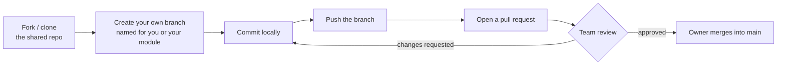

* TOC
{:toc}

When the cohort split into nine project groups, the instructor used the moment to teach a real production Git/GitHub workflow rather than just letting groups improvise — on the reasoning that **"how a repository is used in production to push code collaboratively"** is itself a skill worth deliberately practicing, not an assumed prerequisite.

## The workflow taught

1. **One repository per project**, owned by a designated repository owner (usually the group lead).
2. **Add every group member as a collaborator** on that repository — either individually (Settings → Collaborators → add by email or GitHub ID, with the option to grant admin rights to more than one person), or by having each member fork the repo and submit changes via pull request.
3. **Every contributor works on their own branch**, named for themselves and/or the module they're building — never commits directly to `main`.
4. **Push to that branch, then open a pull request.** The PR gets reviewed by the team before merging into the shared main branch.
5. **The repository owner (or any designated reviewer) reviews and merges** — this is the checkpoint where mistakes get caught before they land in the shared codebase.

The instructor demonstrated this live using his own public contribution to an unrelated open-source AWS repository as a worked example: forking, branching, opening a PR, and — from the maintainer's side — reviewing and merging it, which is exactly what made him "a contributor" on that project's GitHub history. The same mechanism (fork → branch → PR → review → merge) scales from a two-person side project to contributing to a major open-source repository; the group projects were treated as practice for the identical real-world skill.

## Why bother with this level of process for a class project

Two reasons given, worth keeping because they generalize past this specific course:

- **It's genuine practice for how production teams actually operate** — "so that you understand how collaboratively we work in production," in the instructor's words — rather than each student building an isolated script that never has to survive contact with a teammate's conflicting changes.
- **It helps teammates with less prior experience learn by example**, since reviewing a well-structured PR from a more experienced teammate is itself a learning opportunity, not just a formality to get through.

## Individual credit within a group project

A student asked a fair question: if we're building this as a group, how do I show *my own* contribution afterward, separate from the group's shared repository? The answer given: being added as a **collaborator** on the shared group repository is itself durable, visible evidence of contribution — your commits, your PRs, and your review history are all attributable to you individually within that shared repo, the same way an open-source contributor's history is visible regardless of who owns the overall project. Separately, nothing stops you from also cloning the finished project into your *own* personal repository afterward, once the group work is complete, to showcase it independently — both are legitimate and the instructor left it as the group's choice which to do (or both).

## Applying AI coding agents inside a team workflow, without losing understanding

This ties directly back to the [Career & Industry Notes](15-career-and-industry-notes) "learn the city" argument, but with a concrete process attached, given as explicit guidance for the multi-week capstone build (see [Capstone Case Studies](14-capstone-case-studies)):

1. **Build each module separately and test it in isolation** — the RAG pipeline, the SQL agent, the Deep Agent — before trying to wire them together in the LangGraph orchestrator.
2. **You can use coding agents, but don't let them drive the entire build unsupervised.** Generate a piece through a coding agent, then *read and understand what it actually wrote*, and challenge it — ask why it made a given choice, verify the choice makes sense, run it yourself to confirm it actually works, before moving to the next module.
3. Only once each module is understood and verified individually should you combine them into the full multi-agent graph.

The instructor's summary of why this sequencing matters: it's the difference between merely *having* working code and being able to **explain, defend, and fix** it later — which is precisely the gap the "learn the city" argument says your career actually depends on.
